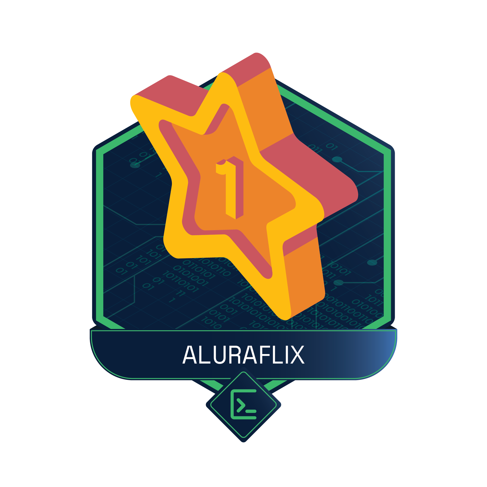

	 
		
	</a>
	 

# aluraflix
 Projeto Alura Challenge Backend AluraFlxix

  

    
Linguagem:

    <ul>	
        <li>JAVA</li>
    </ul>
  

  

    
Framework:

    <ul>
        <li>Spring Boot</li>
    </ul>
  

  

    
Dependecias:

    <ul>
        <li>Spring Web</li>
        <li>Spring Data JPA</li>
        <li>Spring DevTools</li>
        <li>Spring Security</li>
        <li>Lombok</li>
        <li>MySql Driver</li>
        <li>Swagger</li>
    </ul>
  

  

    
Database:

    <ul>
        <li>MariaDB</li>
    </ul>
  

